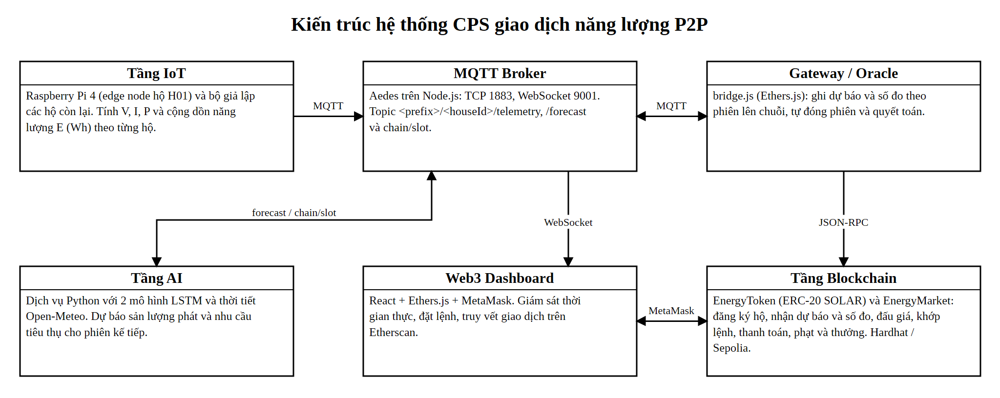

# ☀️ P2P Solar Energy Trading — IoT · AI · Blockchain

> Đồ án cuối kỳ **Blockchain và Ứng dụng** · Đề tài 1 · GVHD: Huỳnh Thế Thiện · **Nhóm 08**<br>
> GitHub: https://github.com/chaeaeaeww/p2p-energy-trading

## Tổng quan

Hệ thống cho các hộ có điện mặt trời mua bán phần điện dư trực tiếp với nhau:

1. **IoT:** Raspberry Pi 4 làm edge node cho hộ H01, tính V/I/P và điện năng (Wh) rồi gửi qua MQTT. Các hộ H02–H04 dùng bộ giả lập.
2. **AI:** 2 mô hình LSTM dự báo sản lượng và nhu cầu điện cho phiên kế tiếp.
3. **Smart Contract:** token ERC-20 **SOLAR** + `EnergyMarket` mở phiên đấu giá, khớp lệnh, thanh toán theo số đo thực tế, phạt giao thiếu 20%, thưởng 1 SOLAR/kWh.
4. **Web3 Dashboard:** React + MetaMask, giám sát realtime, đặt lệnh, truy vết giao dịch trên Etherscan.



| Thành viên | MSSV | Phụ trách | Thư mục |
|---|---|---|---|
| Đoàn Minh Duy Bình | 23139005 | IoT (Raspberry Pi 4) | `iot_code/Pi4/` |
| Thái Hữu Lợi | 23139027 | AI | `ai_model/` |
| Vũ Quốc Bảo | 23139004 | Smart Contract | `contracts/` |
| Lê Nhật Nam | 23139029 | Web3 Dashboard | `dashboard/` |

Báo cáo kỹ thuật: [`docs/report/`](docs/report/)

## Cài đặt (1 lần)

**Máy tính chủ:** cần Node.js 18+, Python 3.10/3.11 và MetaMask.

```bash
git clone https://github.com/chaeaeaeww/p2p-energy-trading.git
cd p2p-energy-trading
cp .env.example .env
cp dashboard/.env.example dashboard/.env
cd contracts && npm install && cd ..
cd dashboard && npm install && cd ..
pip install -r ai_model/requirements.txt
```

**Raspberry Pi 4:** chép `iot_code/Pi4/` vào `~/P2P_Edge_Node`, rồi chạy:

```bash
cd ~/P2P_Edge_Node
python3 -m venv p2p_env && source p2p_env/bin/activate
pip install -r requirements.txt
```

Trong `edge_node.py`, đặt `BROKER` = IP của máy tính chủ. Với Wi-Fi hotspot của Windows thì IP này là `192.168.137.1`.

## Chạy demo (Hardhat local)

**Cách nhanh (Windows):** chạy `AUTO_START.bat`. Script tự mở lần lượt: blockchain → broker MQTT → deploy + seed → Gateway + AI → dashboard, rồi SSH vào Pi (`rinaka@192.168.137.122`) để chạy `edge_node.py`. Nếu IP hoặc user của Pi khác thì sửa dòng cuối của script.

**Cách thủ công:** mỗi dòng chạy trong một terminal.

```bash
cd contracts && npm run node                               # 1. blockchain local
cd contracts && npm run broker                             # 2. MQTT broker (1883 / ws 9001)
cd contracts && npm run deploy:local && npm run seed:local # 3. deploy + tạo hộ H01–H04
cd contracts && npm run bridge:local                       # 4. Gateway / Oracle
cd ai_model && python src/service_lstm.py                  # 5. AI dự báo (:8000)
cd dashboard && npm run dev                                # 6. mở http://localhost:5173
```

Nguồn dữ liệu IoT:

- **Hộ H01 (Raspberry Pi 4):** SSH vào Pi, chạy `source p2p_env/bin/activate && python edge_node.py`.
- **Hộ H02–H04 (giả lập):** trong `.env`, đặt `MOCK_FORECAST=false` và bỏ H01 khỏi `MOCK_HOUSES`, rồi chạy `cd contracts && npm run mock`.

**Trên dashboard:**

1. Trong MetaMask, thêm mạng `Hardhat Local` (RPC `http://127.0.0.1:8545`, chain ID `31337`). Import private key của H01–H04 được in ra ở bước 3.
2. Bấm **Kết nối MetaMask**, chọn hộ, rồi đặt lệnh **Bán** (hộ dư điện) hoặc **Mua** (hộ thiếu điện).
3. Hết phiên (120 s), Gateway tự đóng phiên, khớp lệnh, ghi số đo và thanh toán. Kết quả hiện ở khung **Truy vết on-chain**.

> Muốn các hộ tự giao dịch theo dự báo AI: đặt `AUTO_TRADE=true` trong `.env` trước khi chạy Gateway.
>
> Mỗi lần chạy lại `npm run node`, vào MetaMask → *Settings → Advanced → Clear activity tab data*.

Lệnh hỗ trợ khi demo (chạy trong `contracts/`):

```bash
npx hardhat status --network localhost    # xem phiên, sổ lệnh, số dư
npx hardhat advance --network localhost   # tua nhanh 1 phiên
npm run demo:local                        # chạy trọn 1 phiên bằng script (dự phòng)
npx hardhat test                          # 19 unit test
```

## Chạy trên Sepolia

Điền vào `.env`: `PRIVATE_KEY` (ví testnet có SepoliaETH), `ETHERSCAN_API_KEY` và `SEED_HOUSES=H01:0x…,H02:0x…`. Sau đó chạy:

```bash
cd contracts
npm run deploy:sepolia && npm run seed:sepolia && npm run bridge:sepolia
```

## Tài liệu chi tiết

[Smart contract & Gateway](contracts/README.md) · [AI service](ai_model/README.md) · [Edge node Raspberry Pi 4](iot_code/Pi4/edge_node.py)
