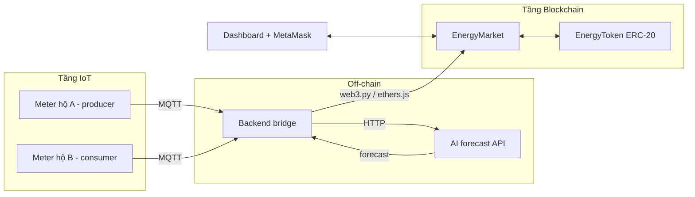

# Kiến trúc hệ thống CPS

## Luồng một phiên giao dịch
1. Meter publish số đo mỗi N giây lên MQTT.
2. Bridge gom dữ liệu, gửi lên AI API để dự báo điện dư / nhu cầu phiên tới.
3. Bridge ghi số đo (đã tổng hợp) + dự báo lên contract (`submitReading`).
4. Hộ dư điện đặt lệnh bán (`placeOffer`), hộ thiếu đặt lệnh mua (`placeBid`) — tự động theo dự báo hoặc thủ công trên dashboard.
5. Hết phiên → `closeAuction()` khớp lệnh, chuyển token từ người mua sang người bán.
6. Dashboard lắng nghe event, hiển thị realtime + link Etherscan.

## Quyết định thiết kế (ghi lại lý do để viết báo cáo)
| Vấn đề | Lựa chọn | Lý do |
|---|---|---|
| Mạng triển khai | Hardhat local → Sepolia | |
| Cơ chế đấu giá | | |
| Đơn vị năng lượng on-chain | Wh (uint256) | tránh số thực |
